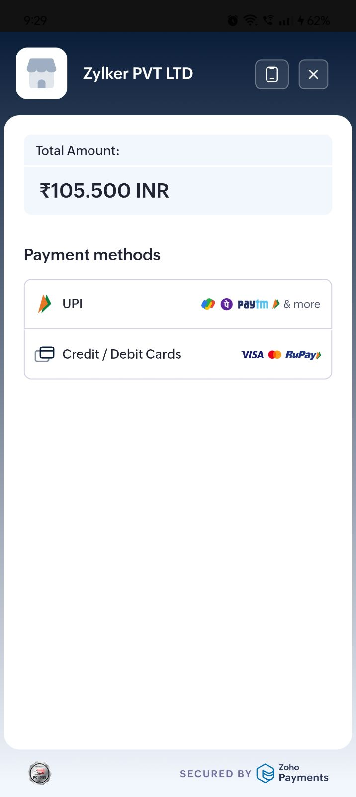
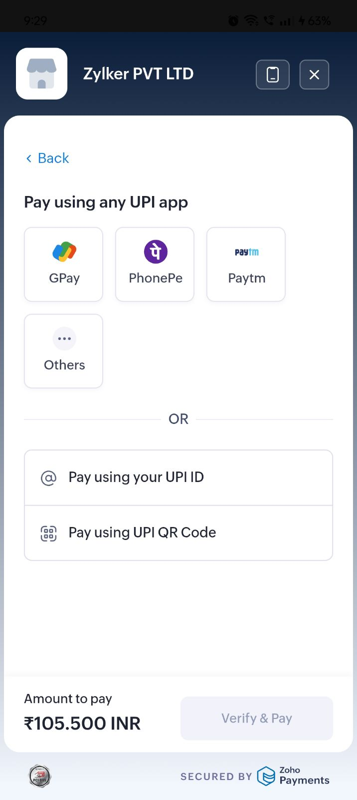
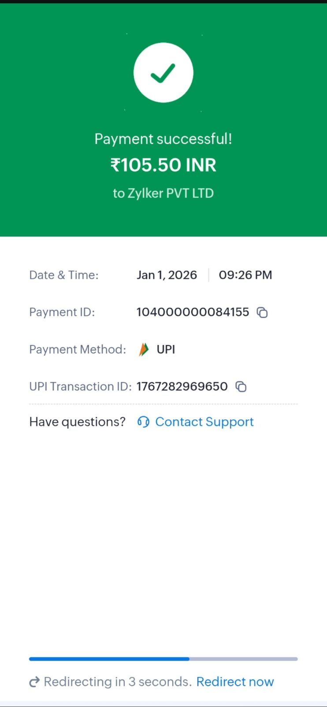

# Flutter Zoho Payments Plugin

A Flutter plugin for integrating Zoho Payments SDK into your Flutter applications. This plugin provides a simple and secure way to accept payments through Zoho's payment gateway.

## Features

- ✅ Easy integration with Zoho Payments SDK
- ✅ Support for multiple payment methods:
  - UPI
  - Credit/Debit Cards
  - Net Banking
- ✅ Secure payment processing
- ✅ Production and Sandbox environment support
- ✅ Comprehensive error handling
- ✅ Type-safe Dart API

## Platform Support

| Platform | Status |
|----------|--------|
| Android  | ✅ Supported (Min SDK 26) |
| iOS      | 🚧 Coming Soon |
| Web      | ❌ Not Supported |

## Installation

Add `flutter_zoho_payments` to your `pubspec.yaml`:

```yaml
dependencies:
  flutter_zoho_payments: ^0.2.5
```

## Setup

### Android Setup

1. Ensure your `android/app/build.gradle` has `minSdkVersion 26` or higher:

```gradle
android {
    defaultConfig {
        minSdkVersion 26
    }
}
```

2. Add Zoho's Maven repository to your `android/build.gradle` or `android/build.gradle.kts` (project level):

**For Groovy (build.gradle):**
```gradle
allprojects {
    repositories {
        google()
        mavenCentral()
        maven { url = uri("https://maven.zohodl.com") }  // Add this line
    }
}
```

**For Kotlin DSL (build.gradle.kts):**
```kotlin
allprojects {
    repositories {
        google()
        mavenCentral()
        maven { url = uri("https://maven.zohodl.com") }  // Add this line
    }
}
```

3. The plugin automatically includes the required permissions for internet access.

### Backend Setup

You'll need a backend server to create payment sessions. The plugin expects your backend to handle:
- Creating payment sessions with Zoho Payments API
- Verifying payment signatures
- Managing order details

## Usage

### 1. Initialize the SDK

```dart
import 'package:flutter_zoho_payments/flutter_zoho_payments.dart';

final zohoPayments = ZohoPayments();

// Initialize with your credentials
await zohoPayments.initialize(
  apiKey: 'your_zoho_api_key',
  accountId: 'your_zoho_account_id',
);
```

### 2. Create a Payment Request

```dart
// First, create a payment session on your backend
// This example assumes you have an endpoint that returns a session ID
final sessionId = await createPaymentSession(); // Your backend call

// Create the payment request
final paymentRequest = PaymentRequest(
  paymentSessionId: sessionId,
  amount: 100.0,
  currency: 'INR',
  customerName: 'John Doe',
  customerEmail: 'john@example.com',
  customerPhone: '+919876543210',
  paymentMethod: PaymentMethod.upi, // Optional: pre-select payment method
  environment: ZohoEnvironment.sandbox, // Optional: defaults to sandbox
);
```

### 3. Start Payment

```dart
try {
  final result = await zohoPayments.startPayment(paymentRequest);
  
  if (result.isSuccess) {
    print('Payment successful! ID: ${result.paymentId}');
    // Verify payment on your backend using paymentId and signature
  } else if (result.isCancelled) {
    print('Payment cancelled by user');
  } else {
    print('Payment failed: ${result.errorMessage}');
  }
} on ZohoPaymentsException catch (e) {
  print('Payment error: ${e.message}');
}
```

## Screenshots & Demo

### Demo Video

https://github.com/user-attachments/assets/1000259892

### Screenshots
  

## Complete Example

```dart
import 'package:flutter/material.dart';
import 'package:flutter_zoho_payments/flutter_zoho_payments.dart';

class PaymentScreen extends StatefulWidget {
  @override
  _PaymentScreenState createState() => _PaymentScreenState();
}

class _PaymentScreenState extends State<PaymentScreen> {
  final _zohoPayments = ZohoPayments();
  
  @override
  void initState() {
    super.initState();
    _initializePayments();
  }
  
  Future<void> _initializePayments() async {
    try {
      await _zohoPayments.initialize(
        apiKey: 'your_api_key',
        accountId: 'your_account_id',
      );
    } catch (e) {
      print('Failed to initialize: $e');
    }
  }
  
  Future<void> _makePayment() async {
    try {
      // Get session ID from your backend
      final sessionId = await _createPaymentSession();
      
      final result = await _zohoPayments.startPayment(
        PaymentRequest(
          paymentSessionId: sessionId,
          amount: 100.0,
          customerName: 'Test User',
          customerEmail: 'test@example.com',
          environment: ZohoEnvironment.live, // Use live for production
        ),
      );
      
      if (result.isSuccess) {
        // Payment successful
        _showSuccessDialog(result.paymentId!);
      }
    } catch (e) {
      print('Payment error: $e');
    }
  }
  
  // ... rest of your UI code
}
```

## API Reference

### ZohoPayments Class

The main class for interacting with Zoho Payments.

#### Methods

##### `initialize()`
Initializes the Zoho Payments SDK with your credentials.

```dart
Future<bool> initialize({
  required String apiKey,
  required String accountId,
})
```

##### `startPayment()`
Starts the payment flow with the given payment request.

```dart
Future<PaymentResult> startPayment(PaymentRequest request)
```

### PaymentRequest Class

Represents a payment request with all necessary details.

#### Properties

| Property | Type | Required | Description |
|----------|------|----------|-------------|
| paymentSessionId | String | Yes | Unique session ID from your backend |
| amount | double | Yes | Amount to charge |
| currency | String | No | Currency code (default: 'INR') |
| customerName | String? | No | Customer's name |
| customerEmail | String? | No | Customer's email |
| customerPhone | String? | No | Customer's phone number |
| paymentMethod | PaymentMethod? | No | Pre-selected payment method |
| environment | ZohoEnvironment | No | Payment environment (default: sandbox) |

### PaymentResult Class

Contains the result of a payment transaction.

#### Properties

| Property | Type | Description |
|----------|------|-------------|
| status | PaymentStatus | Status of the payment |
| paymentId | String? | Unique payment ID from Zoho |
| orderId | String? | Order ID for the transaction |
| signature | String? | Payment signature for verification |
| errorCode | String? | Error code if payment failed |
| errorMessage | String? | Human-readable error message |

#### Methods

- `isSuccess` - Returns true if payment was successful
- `isFailure` - Returns true if payment failed
- `isCancelled` - Returns true if payment was cancelled

## Error Handling

The plugin throws `ZohoPaymentsException` for errors. Always wrap payment operations in try-catch:

```dart
try {
  final result = await zohoPayments.startPayment(request);
} on ZohoPaymentsException catch (e) {
  print('Error code: ${e.code}');
  print('Error message: ${e.message}');
}
```

## Security Best Practices

1. **Never hardcode API credentials** - Store them securely and load from environment variables
2. **Always verify payments on your backend** - Use the payment ID and signature to verify with Zoho's API
3. **Use HTTPS for all backend communications**
4. **Implement proper session management** - Sessions should expire after a reasonable time
5. **Log payment attempts** for debugging and audit purposes

## Testing

The plugin supports both sandbox and live environments:

```dart
// For testing (default)
PaymentRequest(
  paymentSessionId: sessionId,
  amount: 100.0, // Note: Sandbox supports max ₹500
  environment: ZohoEnvironment.sandbox,
)

// For production
PaymentRequest(
  paymentSessionId: sessionId,
  amount: 100.0,
  environment: ZohoEnvironment.live,
)
```

⚠️ **Important**: The sandbox environment currently has a payment limit of ₹500. Ensure your test transactions don't exceed this amount when using sandbox mode.

Always test thoroughly in sandbox before switching to live environment.

## Limitations

- Currently supports Android only (iOS support coming soon)
- Payment UI customization is limited to Zoho's provided options
- Requires minimum Android SDK 26 (Android 8.0)
- **Sandbox Environment Payment Limit**: Zoho Payments sandbox environment currently supports transactions only up to ₹500 (INR). This limit is enforced by Zoho and may change in the future. For testing larger amounts, you'll need to use the production environment with real payment credentials.

## Contributing

Contributions are welcome! Please feel free to submit a Pull Request.

## License

This project is licensed under the MIT License - see the LICENSE file for details.

## Support

For issues and feature requests, please [create an issue](https://github.com/razer-santhosh/flutter_zoho_payments/issues) on GitHub.

For Zoho Payments specific questions, refer to [Zoho Payments Documentation](https://www.zoho.com/payments/api/v1/).